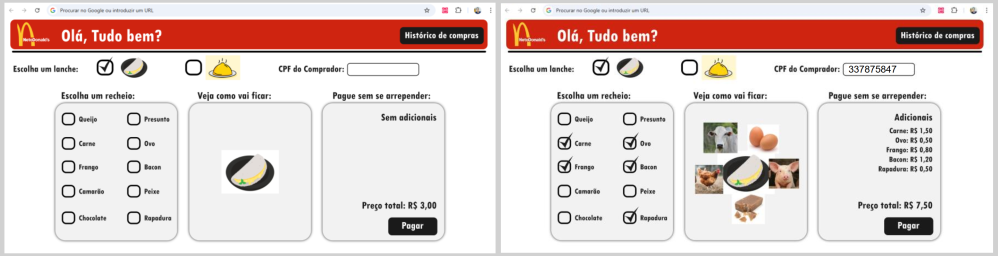

# Projeto NetoDonalds

O projeto consiste em um sistema simples de venda de lanches semelhante ao McDonalds. O sistema irá possibilitar a venda de lanches como tapioca, cuzcuz, sanduiche e panquecas, onde será possível escolher recheios diversos. O sistema será uma aplicação fullstack com back-end, front-end e banco de dados (postgres).

## Design do Projeto



## Como executar a parte Back-end do projeto

1. Clonar o projeto ou baixar os arquivo para a sua máquina.
2. Instalar as dependências executando o comando abaixo dentro da pasta Back-end:

```
npm i
```

3. Executar o servidor (Back-end) com o comando:

```
npm run dev
```

## Dev Log

**Aula 01 - 19/05 (segunda)**

- [x] Criação da base de dados e início do back-end.
  - [x] Criação da estrutura de arquivos do servidor (server.js, controller.js, repository.js e database.js)
  - [x] Criação da tabela **foods** (SQLs na pasta Database)
  - [x] Criação da rota inicial **/foods**